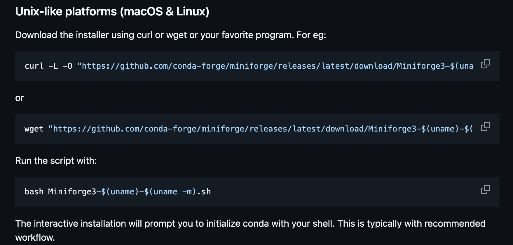

# condaとは

- 環境およびパッケージ管理ツール。
- Pythonのパッケージ管理ツールの`pip`とは異なり、Python以外のパッケージも管理できる。

# インストール (Linux)

今回は、miniforgeを使用します。

1. 公式サイトにアクセスし、インストーラをダウンロードします。
    - [Miniforge - GitHub](https://github.com/conda-forge/miniforge)

2. `Unix-like platforms (macOS & Linux)`の項目を見つける。
   

3. `curl`もしくは`wget`にて、設定ファイルをダウンロード。
   ### どちらか一つでOK
   ```bash
   curl -L -O "https://github.com/conda-forge/miniforge/releases/latest/download/Miniforge3-$(uname)-$(uname -m).sh"
   # もしくは
   wget "https://github.com/conda-forge/miniforge/releases/latest/download/Miniforge3-$(uname)-$(uname -m).sh"
   ```

4. 設定ファイルを実行し、インストール。
   ```bash
   bash Miniforge3-$(uname)-$(uname -m).sh
   ```
    - 色々な質問が出るので、Enterで進めていく。
    - `(END)`と表示されたら、`q`を入力して終了。
    - accept the license terms? [yes|no]という質問が出るので、`yes`を入力し、Enter。
    - 
    - You can undo this by running `conda init --reverse $SHELL`? [yes|no]という質問が出るので、`no`を入力し、Enter。

5. condaの初期化と確認
   ```bash
    eval "$(/home/coder/miniforge3/bin/conda shell.zsh hook)"

    conda --version
   ```
