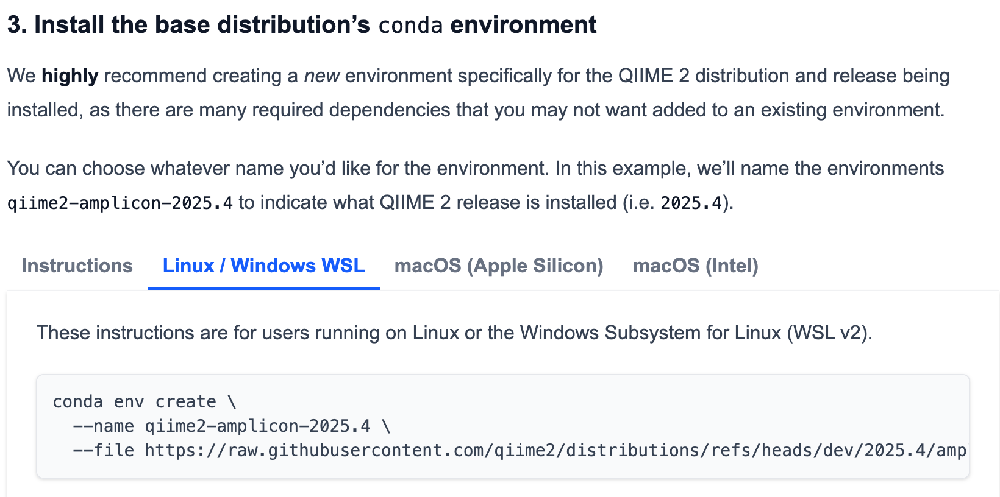

# Qiime2関連URL

- [Qiime2 Top](https://qiime2.org/)
- [Document](https://docs.qiime2.org/2024.10/)
- [Install](https://docs.qiime2.org/2024.10/install/)

※ Qiime2は定期的にバージョンアップされており、そのたびにドキュメントも更新されています。URL中の`2024.10`は、バージョンを指しています。できるだけ最新を参照してください。

# Install
### 1. Installページにアクセス
- [https://docs.qiime2.org/2024.10/install/](https://docs.qiime2.org/2024.10/install/)
- `Natively installing QIIME 2`をクリック。


### 2. condaでのインストール方法を選択
- 今回は、`Amplicon`解析、
`Install QIIME 2 within a conda environment` > `QIIME 2 Amplicon Distribution`
を見つける。
- `Linux`をクリック。


### 3. インストール
- `conda ...`のコマンドをコピーし、ターミナルに貼り付けて実行。
- 途中、`Proceed ([y]/n)?`と聞かれた場合は、`y`を入力して進める。
- 数分待つ

# conda環境の有効化
condaのメリットは、`RNA-Seq`や`Qiime2`、`Python`など、環境ごとにパッケージを管理できることです。<br>
現在、Qiime2環境の外にいるため、`qiime`コマンドが使えない状態です。<br>
```bash
qiime --help
```

使用するためには、環境を有効化する必要があります。<br>
まずは、環境名を確認します。<br>

```bash
conda env list
```

<br>
今回は、以下の出力になるはずです。<br>

```
# conda environments:
#
base                 * /home/coder/miniforge3
qiime2-amplicon-2024.10   /home/coder/miniforge3/envs/qiime2-amplicon-2024.10
```

`qiime2-amplicon-2024.10`をコピーし、以下のコマンドを実行して有効化します。<br>
```
conda activate qiime2-amplicon-2024.10
```

これで、Qiime2環境が有効化されました。<br>
`qiime`コマンドが使えるようになります。<br>

```bash
qiime --help
```

