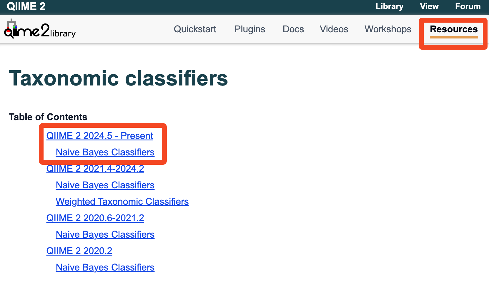
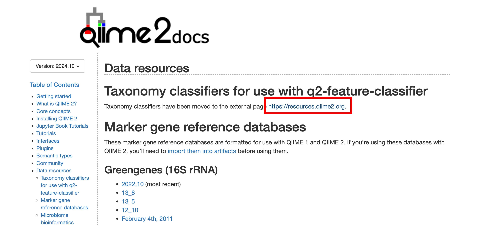
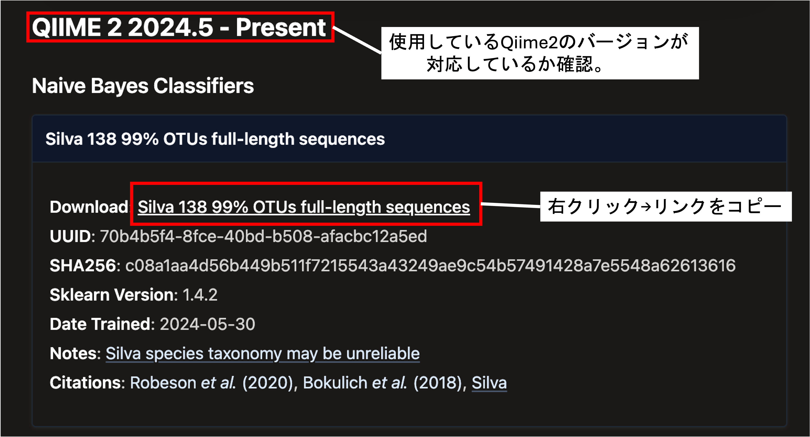

# 編集中

## はじめに

### 初期値

`raw-data/`中に、各自のデータをお配りしました。<br>
```text
raw-data/
    ├── <YOURSAMPLE>_R1_001.fastq.gz
    └── <YOURSAMPLE>_R2_001.fastq.gz
```

※自分の環境で解析を行う場合は、あらかじめ`raw-data/`フォルダを作成し、fastqファイルを入れた後、以下の手順を進めてください。


### 目標

```text
raw-data/
    ├── <YOURSAMPLE>_R1_001.fastq.gz
    └── <YOURSAMPLE>_R2_001.fastq.gz
manifest.tsv
01_data-import/
    └── demux-paired-end.qza
02_adapter/
    ├── trimmed-seqs.qza
    └── trimmed-seqs.qzv
03_denoise/
    ├── table-dada2.qza
    ├── table-dada2.qzv
    ├── rep-seqs-dada2.qza
    ├── rep-seqs-dada2.qzv
    ├── stats-dada2.qza
    └── stats-dada2.qzv
04_taxonomy/
    ├── taxa-bar-plots.qzv
    ├── taxonomy.qza
    └── taxonomy.qzv
```

## menifestファイルの作成

```bash
seqfu metadata -f manifest -s _S raw-data > manifest.tsv
```

## 01_data-import

```bash
# ディレクトリの作成
mkdir 01_data-import

# manifest.tsvに従って、データを
# 01_data-import/demux-paired-end.qza として保存。
qiime tools import \
    --type "SampleData[PairedEndSequencesWithQuality]" \
    --input-path manifest.tsv \
    --input-format PairedEndFastqManifestPhred33V2 \
    --output-path ./01_data-import/demux-paired-end.qza
```

## 02_adapter

```bash
# ディレクトリの作成
mkdir 02_adapter

# Primer配列の定義
FWD='CCTACGGGNGGCWGCAG' ## V3V4用
REV='GACTACHVGGGTATCTAATCC' ## V3V4用

FWDRC=$(echo "${FWD}" | tr ACGTMRYKVHDBacgtmrykvhdb TGCAKYRMBDHVtgcakyrmbdhv | rev)
REVRC=$(echo "${REV}" | tr ACGTMRYKVHDBacgtmrykvhdb TGCAKYRMBDHVtgcakyrmbdhv | rev)

# アダプタートリミング
## 次のオプションに注意。
## --p-discard-untrimmed: トリムされなかったリードは使わない。
## --p-cores: 並列処理につかうスレッドの数
qiime cutadapt trim-paired \
    --i-demultiplexed-sequences ./01_data-import/demux-paired-end.qza \
    --p-front-f ${FWD} --p-front-r ${REV} \
    --p-adapter-f ${REVRC} --p-adapter-r ${FWDRC} \
    --p-times 10 \
    --p-match-read-wildcards --p-match-adapter-wildcards \
    --p-minimum-length 200 \
    --p-discard-untrimmed \
    --o-trimmed-sequences ./02_adapter/trimmed-seqs.qza \
    --p-cores 1

# visualizationファイルへ出力。
qiime demux summarize --i-data ./02_adapter/trimmed-seqs.qza --o-visualization ./02_adapter/trimmed-seqs.qzv
```

## クォリティの確認

次のDADA2では、

1. キメラ配列の削除
2. 低クオリティ部分をカット
3. ForwardとReverseを繋ぎ合わせる。

を行います。<br>
`2. 低クオリティ部分`については、解析者が手動で指定する必要があります。

`.qzv`はvisualizationファイルで、各ステップの結果を可視化することができます。

### `.qzv`ファイルの可視化方法

#### 1. (今回使用)Qiime2 Viewへアップロード
[https://view.qiime2.org/](https://view.qiime2.org/)

#### 2. `qiime tools view`コマンド
手元のPC（MacBookなど）にQiime2をインストールしている場合、この方法が使用できます。

```bash
qiime tools view <file>.qzv
```

### `.qzv`データのエクスポートと`.tsv`の可視化。

```bash

qiime tools export --input-path ./02_adapter/trimmed-seqs.qza --output-path ./02_adapter/outputs

# Forward配列の結果を可視化。qで終了。
csvlens -d auto ./02_adapter/outputs/forward-seven-number-summaries.tsv
# Reverse配列の結果を可視化。qで終了。
csvlens -d auto ./02_adapter/outputs/reverse-seven-number-summaries.tsv

```


## 03_denoise

```bash
# ディレクトリの作成
mkdir 03_denoise

# DADA2
## fffとrrrは適宜変更
qiime dada2 denoise-paired \
    --i-demultiplexed-seqs ./02_adapter/trimmed-seqs.qza \
    --p-trunc-len-f fff \
    --p-trunc-len-r rrr \
    --o-table ./03_denoise/table-dada2.qza \
    --o-representative-sequences ./03_denoise/rep-seqs-dada2.qza \
    --o-denoising-stats ./03_denoise/stats-dada2.qza \
    --p-n-threads 1

# 各qzaファイルをqzvファイルへ
## 何%削除されたなどの、DADA2のステータス
qiime metadata tabulate --m-input-file ./03_denoise/stats-dada2.qza --o-visualization ./03_denoise/stats-dada2.qzv

## 各サンプルのリード数など
qiime feature-table summarize --i-table ./03_denoise/table-dada2.qza --o-visualization ./03_denoise/table-dada2.qzv

## Forward+Reverse マージ後に決定した代表配列の一覧
qiime feature-table tabulate-seqs --i-data ./03_denoise/rep-seqs-dada2.qza --o-visualization ./03_denoise/rep-seqs-dada2.qzv
```

## 04_taxonomy

### 分類器(データベース)のダウンロード

[https://docs.qiime2.org/2024.10/](https://docs.qiime2.org/2024.10/)


[https://docs.qiime2.org/2024.10/data-resources/](https://docs.qiime2.org/2024.10/data-resources/)




```bash

# コピーしたURLからダウンロード
wget https://data.qiime2.org/classifiers/sklearn-1.4.2/silva/silva-138-99-nb-classifier.qza

```

```bash

qiime feature-classifier classify-sklearn \
    --i-reads ./03_denoise/rep-seqs-dada2.qza \
    --i-classifier ./silva-138-99-nb-classifier.qza \
    --o-classification ./04_taxonomy/taxonomy.qza \
    --p-n-jobs 1

qiime metadata tabulate \
    --m-input-file ./04_taxonomy/taxonomy.qza \
    --o-visualization ./04_taxonomy/taxonomy.qzv

qiime taxa barplot \
    --i-table ./03_denoise/table-dada2.qza \
    --i-taxonomy ./04_taxonomy/taxonomy.qza \
    --o-visualization ./04_taxonomy/taxa-bar-plots.qzv

```

